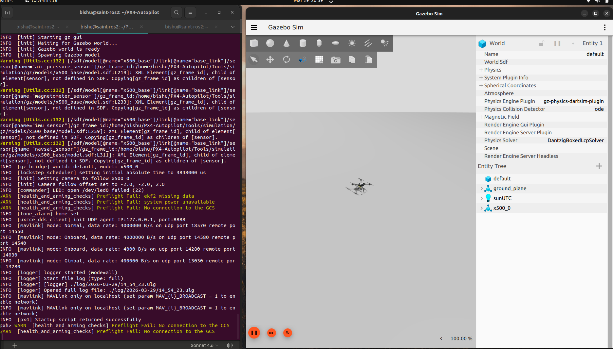
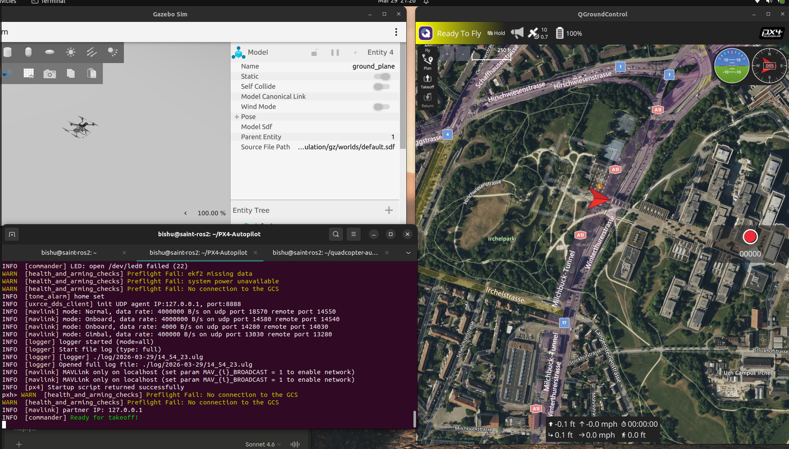
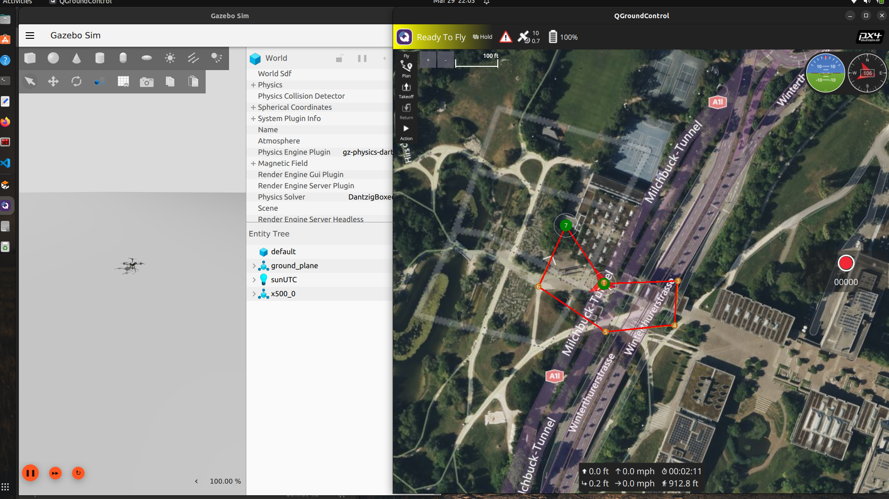

cat > ~/quadcopter-autonomy/00-sitl-setup/README.md << 'EOF'
# Phase 0 — PX4 SITL + Gazebo Setup

## Objective
Set up PX4 Software-In-The-Loop (SITL) simulation with Gazebo Harmonic on Ubuntu 22.04 before touching any real hardware.

## Environment
| Component | Version |
|-----------|---------|
| OS | Ubuntu 22.04.5 LTS |
| PX4 Autopilot | v1.14 (built from source) |
| Gazebo | Harmonic 8.11.0 |
| ROS 2 | Humble |
| Host | bishu@saint-ros2 |

## Setup Steps Completed

### Step 1 — PX4 Source Clone
```bash
git clone https://github.com/PX4/PX4-Autopilot.git --recursive
```

### Step 2 — Dependency Installation
```bash
bash ~/PX4-Autopilot/Tools/setup/ubuntu.sh
```
Installed: ARM cross-compiler (10.3.1), Gazebo Harmonic (8.11.0), Python packages, uXRCE-DDS tools.

### Step 3 — First SITL Build + Launch
```bash
cd ~/PX4-Autopilot
make px4_sitl gz_x500
```
Build time: ~12 minutes (first build).

## Results

### Gazebo Harmonic — First Launch ✅


X500 quadrotor spawned successfully in Gazebo Harmonic. PX4 SITL connected to Gazebo bridge via gz_bridge.

### PX4 Shell Output — Key Lines
```
INFO  [init] Gazebo simulator 8.11.0
INFO  [init] Gazebo world is ready
INFO  [init] Spawning Gazebo model
INFO  [gz_bridge] world: default, model: x500_0
INFO  [px4] Startup script returned successfully
INFO  [uxrce_dds_client] init UDP agent IP:127.0.0.1, port:8888
```

## Current Status
- [x] PX4 built from source
- [x] Gazebo Harmonic launching with X500 model
- [x] uXRCE-DDS client running on port 8888
- [ ] QGroundControl connected
- [ ] ROS 2 uXRCE-DDS agent running
- [ ] Offboard control node written

## Next Steps
1. Connect QGroundControl to SITL
2. Install and run uXRCE-DDS micro-agent
3. Write ROS 2 telemetry subscriber node
4. Write ROS 2 offboard takeoff/hover/land node

## Milestone 2 — First Autonomous Mission ✅

### Mission Profile
- Waypoints: 7
- Altitude: 50ft
- Mode: AUTO.MISSION
- Result: Full waypoint sequence completed, RTL successful

### Screenshots



