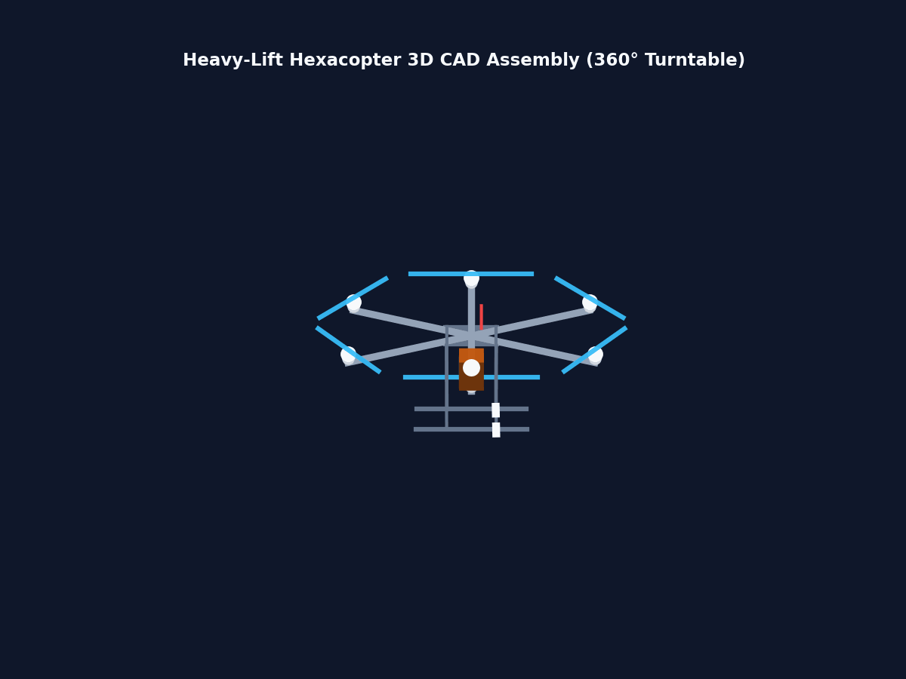
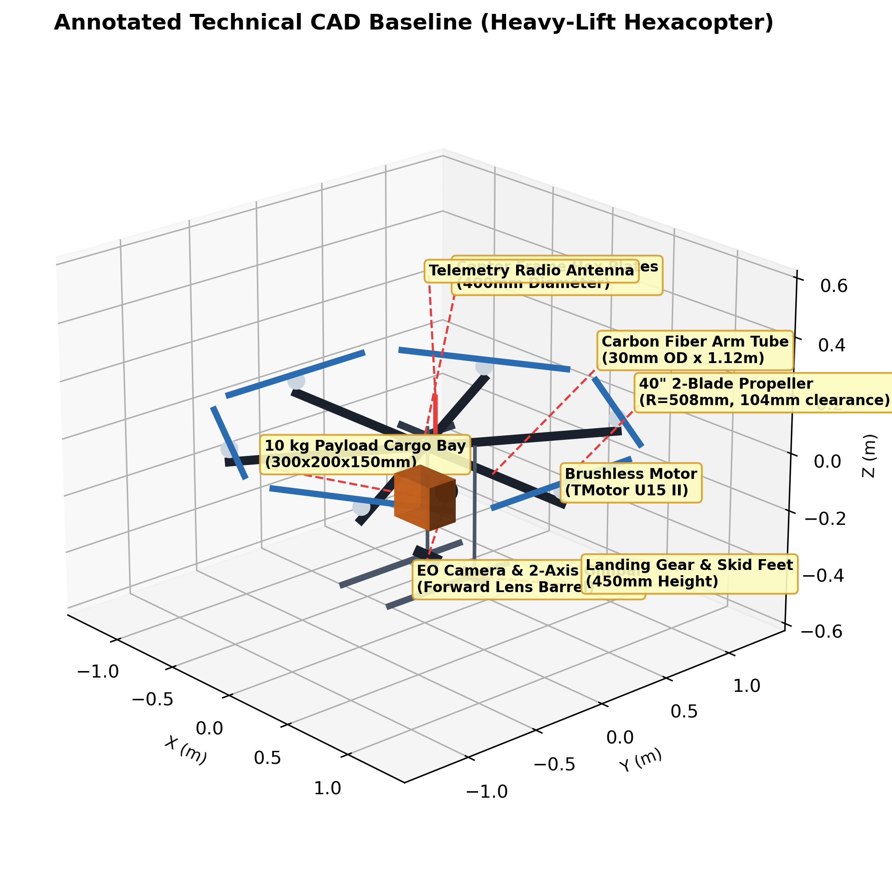
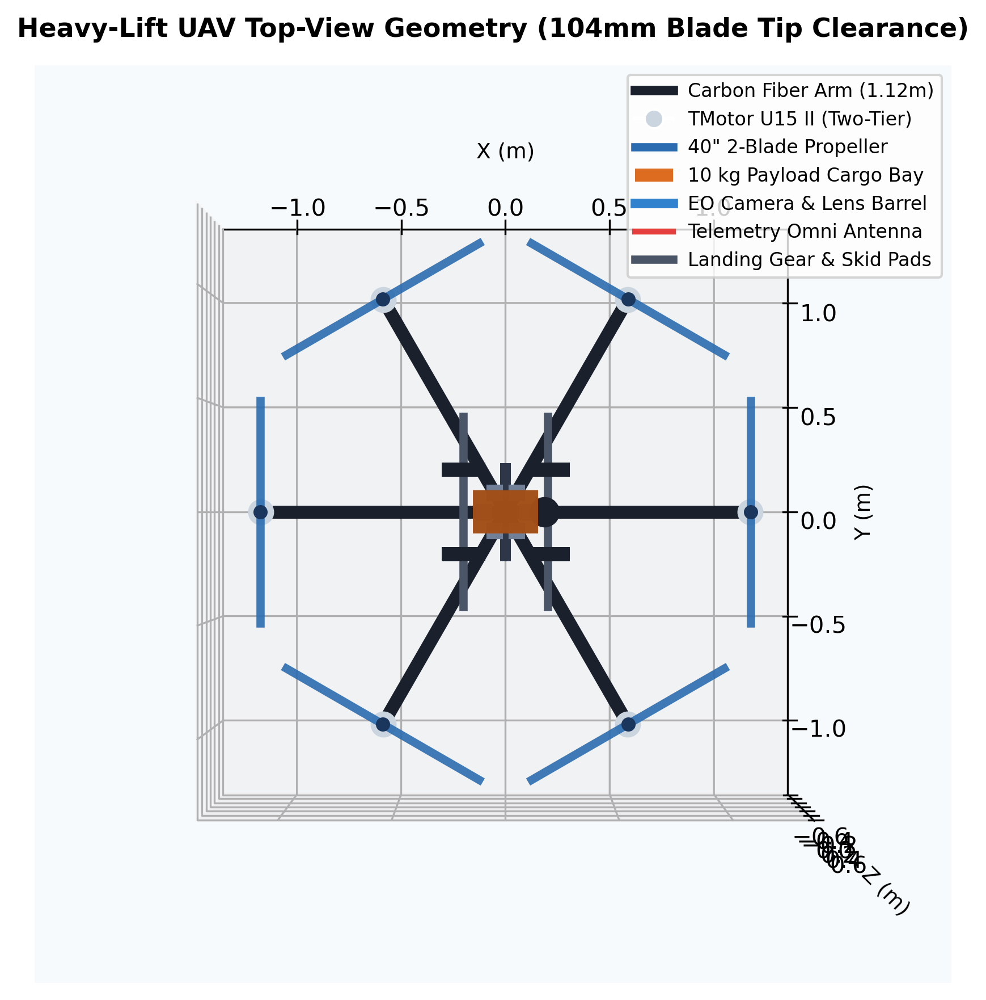
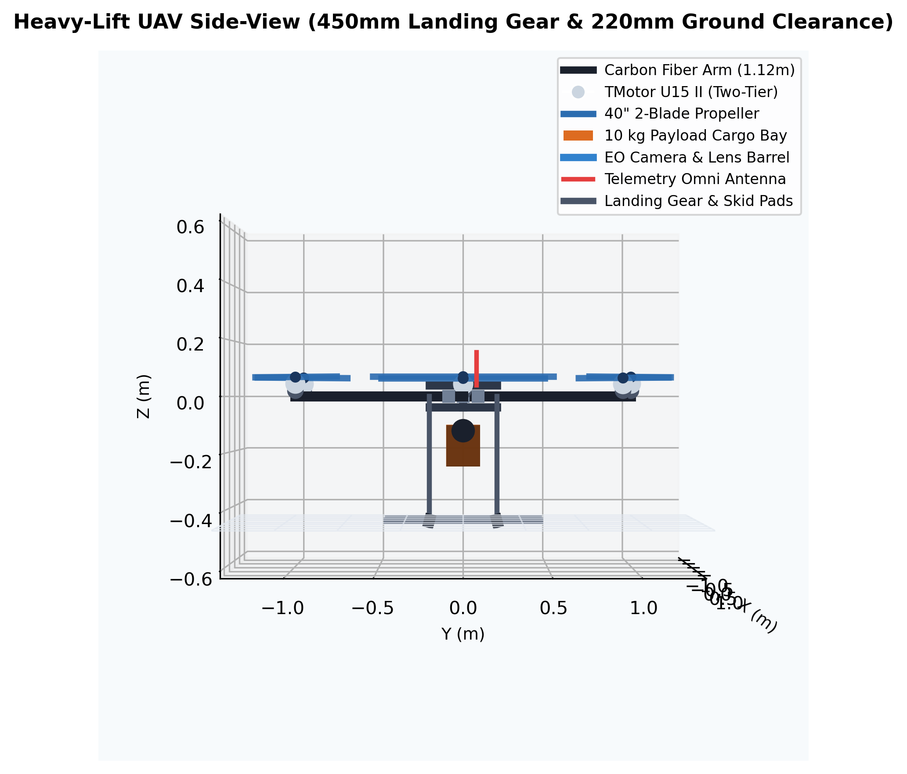
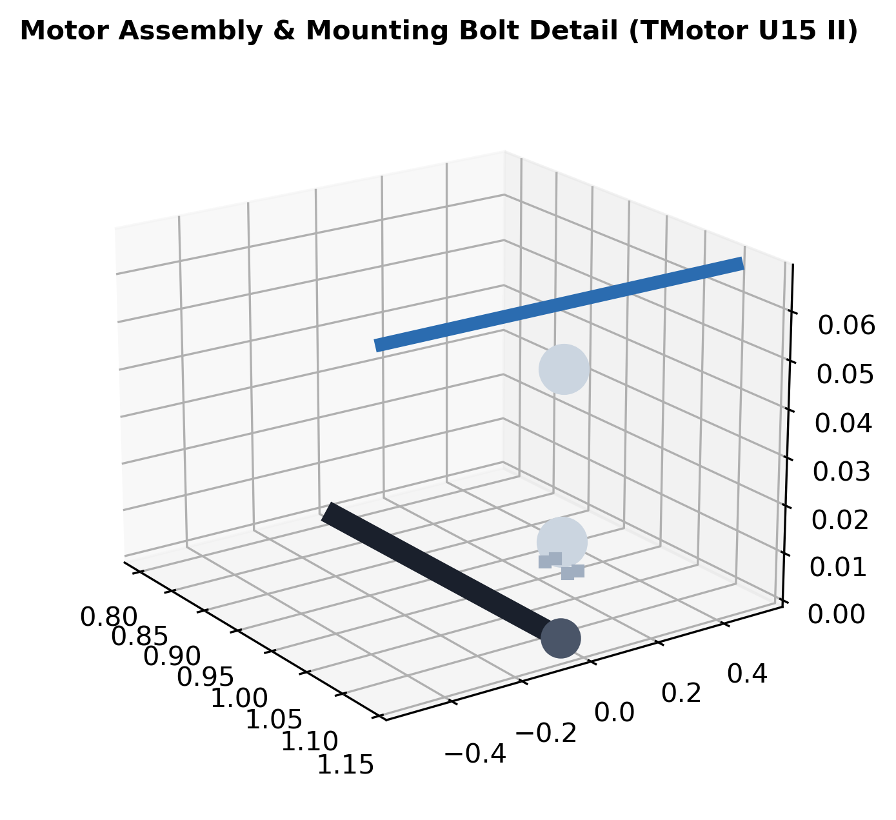

# Heavy-Lift Battery-Electric Hexacopter UAV Engineering Suite



This directory contains the high-fidelity engineering design, parametric 3D CAD modeling, aerodynamic BEM simulation, structural FEA, and KiCad electrical schematic for a heavy-lift multirotor Unmanned Aerial Vehicle (UAV).

---

## 🎯 Target Specifications & Locked Baseline (`DESIGN_LOCK.md`)

* **Payload Capacity:** 10.0 kg (Safety Orange Cargo Bay Box $300 \times 200 \times 150\text{ mm}$ + EO Camera 2-Axis Gimbal)
* **Configuration:** Single-Motor Hexacopter (6 arms @ $60^\circ$ radial spacing, 1 motor + 1 ESC + 1 prop per arm)
* **Arm Tube Length ($L$):** **1.120 m** (30mm OD $\times$ 2mm wall carbon tube) $\rightarrow$ **104 mm tip-to-tip clearance** (Zero Propeller Overlap)
* **Propellers:** **40" $\times$ 13" Carbon Fiber** ($R = 0.508\text{ m}$, NACA 4412 airfoil section)
* **Total Takeoff Weight (TOW):** **37.291 kg** (Converged via 9-iteration mass-power-battery loop)
* **Power Plant:** **520 Wh/kg Semi-Solid-State Battery Pack** (12S Pack: 44.4V Nominal, **12.129 kg** pack mass)
* **Hover Power & Current:** **3,836.1 W** (Total electrical hover power, **86.3 A** total, **14.4 A** per ESC branch)
* **Mission Profile:** 30 km out-and-back + 20 min hover loiter (104.0 min total mission duration, **6,307.2 Wh** total battery capacity carried)
* **Governing Structural Load Case:** Asymmetric Motor-Out Emergency Recovery (1.5G, $\sigma_{\max} = 177.3\text{ MPa}$, **Safety Factor = 4.51** $\ge 1.5$)

---

## 🎬 How to Present & Show Your 3D CAD Model

When presenting this CAD model to recruiters, professors, or engineering reviewers, use these **4 Key Angles & Technical Nuances**:

| View / Angle | Recommended Image | Key Nuances & Talking Points to Highlight |
| :--- | :--- | :--- |
| **1. Isometric Hero View** |  | **Overall 3D Balance:** Highlights the center plate layout, carbon arms, 10kg cargo bay, camera gimbal, antenna, and skid feet. Explains how payload box centered at $[0, 0, -0.15]\text{ m}$ balances CG. |
| **2. Top-Down Orthographic** |  | **Zero Propeller Overlap Proof:** Show that adjacent 40" props ($1.016\text{ m}$ diameter) on $1.12\text{ m}$ arms have **104 mm tip clearance**. Explain why $0.8\text{ m}$ arm length failed ($216\text{ mm}$ overlap) and why $1.12\text{ m}$ solves aerodynamic interference. |
| **3. Side Elevation** |  | **Ground Clearance & Landing Safety:** Shows $450\text{ mm}$ landing gear height and $220\text{ mm}$ payload ground clearance to protect camera and cargo during hard landings (3--5G load case). |
| **4. Subsystem Zoom Details** |  | **Manufacturing Details:** Points out the 4x M4 bolt pattern (PCD 40mm), two-tier motor housing (stator base vs rotor bell), and tapered propeller blade root interface. |

---

## 📁 Native Engineering File Deliverables

### 1. Reports & Documentation
* 📄 **ReportLab Sizing & Design Report (PDF):** [`reports/heavy_lift_uav_design_report.pdf`](reports/heavy_lift_uav_design_report.pdf)
* 📖 **Sizing & Physics Blog Post (Markdown):** [`blog/heavy-lift-uav-design-story.md`](blog/heavy-lift-uav-design-story.md)
* 🔒 **Locked Design Baseline (Source of Truth):** [`DESIGN_LOCK.md`](DESIGN_LOCK.md)
* 📖 **Pedagogical Sizing Walkthrough (Markdown):** [`CALCULATION_WALKTHROUGH.md`](CALCULATION_WALKTHROUGH.md)
* 📋 **Design Compliance & Review Checklist:** [`REPORT_REVIEW_CHECKLIST.md`](REPORT_REVIEW_CHECKLIST.md)

### 2. 3D CAD & Parametric Modeling
* 📦 **ISO STEP AP214 3D Assembly:** [`freecad/hexacopter_assembly.step`](freecad/hexacopter_assembly.step)
* 📐 **Parametric FreeCAD Python Script:** [`freecad/hexacopter_assembly.py`](freecad/hexacopter_assembly.py)
* 💾 **FreeCAD Native Project File:** [`freecad/final.FCStd`](freecad/final.FCStd)
* 🎨 **Renders & 3D Wavefront Mesh:** [`reports/uav_assembly.obj`](reports/uav_assembly.obj) (and figures in [`reports/figures/`](reports/figures/))
* 🖨️ **3D Printing STL Model (1:10 scale):** [`reports/uav_assembly_1_10.stl`](reports/uav_assembly_1_10.stl)

### 3. Propulsion & Aerodynamics (XFLR5 / QBlade)
* 🛩️ **XFLR5 Propeller Geometry & Foil Project:** [`xflr5/propeller_40x13_geometry.xfl`](xflr5/propeller_40x13_geometry.xfl)
* 📝 **QBlade Rotor Definition File:** [`xflr5/propeller_40x13_qblade.bld`](xflr5/propeller_40x13_qblade.bld)
* 📊 **QBlade AeroDyn Polar Table:** [`xflr5/propeller_40x13_aerodyn.dat`](xflr5/propeller_40x13_aerodyn.dat)
* 📝 **Rotor Blade Station Geometry:** [`xflr5/propeller_40x13_blade.txt`](xflr5/propeller_40x13_blade.txt)
* 📄 **NACA 4412 Airfoil Section Coordinates:** [`xflr5/naca4412.dat`](xflr5/naca4412.dat)

### 4. KiCad Electrical Power Architecture
* ⚡ **KiCad 9.0.9 Schematic Source File:** [`kicad/power_and_signal_schematic.kicad_sch`](kicad/power_and_signal_schematic.kicad_sch)
* ⚙️ **Programmatic KiCad v9 Schematic Generator:** [`kicad/generate_schematic_v9.py`](kicad/generate_schematic_v9.py)

### 5. Python Sizing & Simulation Suite
* ⚖️ **TOW Sizing & Convergence Loop:** [`design_calculations/mass_budget.py`](design_calculations/mass_budget.py)
* 🔋 **Mission Profile & Power Simulator:** [`design_calculations/power_endurance.py`](design_calculations/power_endurance.py)
* 🪵 **Cantilever Arm Bending & FEA Stress Solver:** [`design_calculations/structural_analysis.py`](design_calculations/structural_analysis.py)
* 🔌 **Motor-ESC Electrical Sizing & Efficiency:** [`design_calculations/propulsion.py`](design_calculations/propulsion.py)
* 🌀 **Blade Element Momentum Aerodynamic Solver:** [`simulation/rotor_bem.py`](simulation/rotor_bem.py)
* 🖥️ **CAD FreeCAD Image Rendering Script:** [`simulation/generate_cad_model.py`](simulation/generate_cad_model.py)
* 🚀 **Master PDF Report & Figure Generator:** [`generate_report.py`](generate_report.py)

---

## 💻 Quick Start & Commands

To rebuild report figures, compile the documents, or run simulations:
```bash
# 1. Regenerate 3D CAD images, BEM curves, and KiCad schematic diagrams:
python3 projects/heavy-lift-uav/simulation/generate_cad_model.py

# 2. Run master design compilation (ReportLab PDF + figures):
python3 projects/heavy-lift-uav/generate_report.py
```
