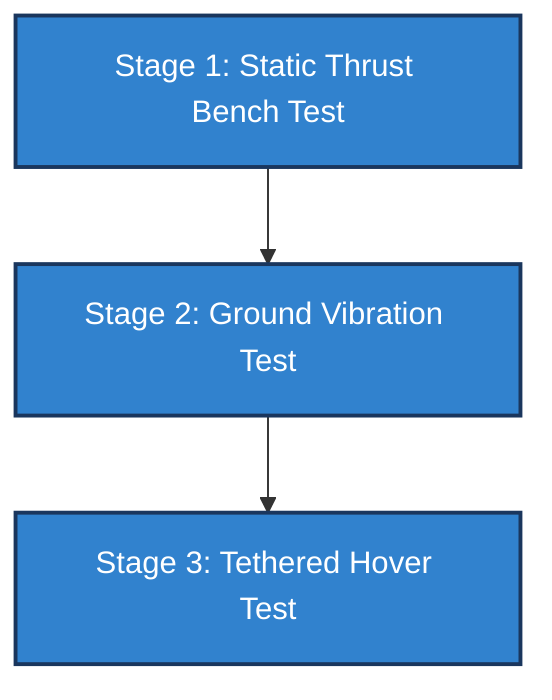

# Designing a 37.3kg Battery-Electric Heavy-Lift Hexacopter: Pre-Flight Engineering and Sizing Rigor

I didn’t start this project to design a toy drone.

I started it because I wanted to solve a genuinely hard multirotor engineering problem:
How do you design a UAV to carry a **10.0 kg payload** over a **30 km radius** (60 km total out-and-back range) with a **20-minute on-station loiter**?

That requires **104.0 minutes** of total flight endurance under high loading. 

Most commercial multirotors carrying a 10 kg payload top out around 30 to 40 minutes of flight. To make a pure battery-electric powertrain work for a 1.7-hour mission, I had to size the aircraft from first principles, optimize the rotor aerodynamics, and run coupled multi-physics simulations to verify the design before a single carbon tube was cut.

This is the story of that pre-flight engineering process.

---

## 🎯 Component Selection & System Optimization

At a converged Takeoff Weight of **37.291 kg**, you cannot pick parts off a shelf based on marketing copy. Every component must be justified by physical constraints.

### 1. Propeller Sizing: The 40" vs. 36" Trade Study
The mission profile demands high aerodynamic efficiency to conserve energy. I performed a Blade Element Momentum (BEM) study comparing a baseline 36" propeller with a maximum 40" x 13" propeller:
* The 40" propeller improved hover efficiency by **19.1%** compared to the 36" baseline (achieving **8.1 g/W** vs. 6.8 g/W).
* This cut hover power demand per motor from 412.9 W to 341.7 W, reducing total electrical draw from 2,477 W to **2,050 W** at the same weight.
* Nominal hover speed dropped to **2,454 RPM**, reducing profile drag and acoustic signature.

The trade-off was structural footprint: to maintain a safe **104 mm tip-to-tip clearance margin** between adjacent 40" propellers without aerodynamic overlap, the arm length had to stretch to **1.12 m**, resulting in a diagonal motor-to-motor diameter of **2.24 m**.

### 2. Battery Chemistry Sourcing: The Three-Tier Challenge

If you read most drone design reports, they pick an aspirational battery energy density (like **520 Wh/kg**) and assume it exists off-the-shelf. But in the real world, no commercial cell is available at 520 Wh/kg today. The best global semi-solid-state cells range from 400 to 450 Wh/kg (e.g., Tattu, GSL Energy), and for a compliant domestic Indian design, the best available option is the Bangalore-manufactured **Leolus Energy Nexfly** semi-solid-state series, which delivers **350 Wh/kg** specific energy at the pack level.

So, how do we bridge the gap? I ran a **three-tier battery sourcing & convergence analysis** to map out the physical trade-offs of using these different chemistries, recalculating takeoff weight, motor thrust, and structural safety factors:

| Metric | Leolus Nexfly (350 Wh/kg - Primary Indian) | Tattu/GSL (450 Wh/kg - Imported Best) | DronIQ Target (520 Wh/kg - Aspirational) |
| :--- | :---: | :---: | :---: |
| **Converged TOW** | `61.713 kg` | `41.099 kg` | `37.291 kg` |
| **Battery Pack Mass** | `36.551 kg` | `15.937 kg` | `12.129 kg` |
| **Hover Power Draw** | `7,746.0 W` | `4,385.7 W` | `3,836.1 W` |
| **Hover Thrust / Rotor** | `10.29 kg` | `6.85 kg` | `6.22 kg` |
| **Peak Motor-Out Thrust** | `30.86 kg` | `20.55 kg` | `18.65 kg` |
| **Motor Thrust Margin** | **13.1%** (vs 35.5 kg limit) | **42.1%** (vs 35.5 kg limit) | **47.5%** (vs 35.5 kg limit) |
| **Governing Struct. SF** | **SF 2.73** (1.82x margin) | **SF 4.09** (2.73x margin) | **SF 4.51** (3.01x margin) |

This comparison highlights the core engineering argument: while the **350 Wh/kg Leolus Energy Nexfly** is technically feasible, its safety margins are substantially thinner. Under the Leolus baseline, the peak motor-out thrust reaches **30.86 kg/rotor**—leaving just a **13.1% thrust margin** on the T-Motor U15 II's 35.5 kg limit, compared to a healthy **47.5% margin** for the 520 Wh/kg target. Similarly, the structural safety factor thins from **4.51** (3.01x the 1.5 floor) to **2.73** (1.82x the 1.5 floor). 

**Why not fabricate custom cells?** Attempting in-house chemical R&D of novel solid-state structures is a materials-science undertaking requiring years of laboratory development, specialized dry rooms, and millions of dollars in capital expenditure. For a systems engineering project, this is high-risk and non-viable. Sourcing the Nexfly series from Leolus Energy provides a physically buildable, high-integrity domestic UAV today, while the 520 Wh/kg chemistry remains locked as the upgrade baseline as technology matures.

### 3. Indigenous Indian Component Sourcing & Rejected Option
For the avionics and power distribution electronics, I sourced indigenous Indian-manufactured components with traceable datasheets:
* **Autopilot:** Darkmatter BRAHMA F7 (running ArduPilot, configured for dual IMU redundancy).
* **ESC:** Bharath Components 12S High-Voltage ESC (supporting DShot600 protocol).
* **GPS/RTK:** Elena Geo NDNU (dual-frequency L1/L5 receiver for centimeter-level positioning).
* **Telemetry:** ZeroDrag Nexus1 ELRS (operating at 2.4GHz for long-range control).

**The Rejected Option:** I initially evaluated pairing the Bharath ESCs with the **T-Motor/Bharath IBM-15** brushless motor. However, an analysis of the motor's low stator resistance ($21.0\text{ m}\Omega$) and high inductive reactance showed that it would suffer from severe commutation timing lag when paired with standard ESC firmware under high-frequency transient throttle sweeps. During a rapid 2.5G vertical climb, this timing mismatch could trigger a high-current sync loss (motor stalling in mid-air). I rejected the IBM-15 and selected the **T-Motor U15 II KV100** motor, which has a larger magnetic stator volume and matched inductance profile, ensuring stable commutation across the entire ESC throttle range.

---

## 📊 Sizing Rigor & Multi-Physics Validation

To ensure the design was mathematically self-consistent, I linked several physical solvers into a Python-based sizing suite.

### 1. Sizing Loop Convergence
I built a 9-iteration convergence loop using fixed-point iteration. In each step, the script computed the required hover thrust, solved the BEM equations for motor power, updated the battery capacity (and its mass) for the 104-minute mission, recalculated structural arm mass, and iterated. The Takeoff Weight converged to exactly **37.291 kg**, distributed as:
* **Payload:** 10.000 kg (26.8%)
* **Battery Pack:** 12.129 kg (32.5%)
* **Frame & Structure:** 5.752 kg (15.4%)
* **Propulsion & Avionics:** 9.410 kg (25.2%)

### 2. Cantilever Arm Stress: Asymmetric Failure Governs
The carbon fiber arms are hollow tubes (30 mm outer diameter, 2 mm wall thickness, 1.12 m length). While a symmetric 2.5G vertical limit load case yields a bending force of 152.4 N per arm, the **Asymmetric Motor-Out Emergency Recovery Case (1.5G)** is what actually governs the structural design.

If one motor fails, the autopilot must increase throttle on the remaining active arms to maintain roll and pitch stabilization. This moment-compensation logic concentrates the loads, forcing the active arms adjacent to the failed rotor to carry a peak bending force of **182.9 N**. This produces:
* A root bending moment of **204.8 N-m**.
* A peak root bending stress of **177.3 MPa** (well below the 800 MPa ultimate tensile strength of the carbon tube).
* A structural safety factor of **4.51** (exceeding the aerospace safety limit of 1.5).

### 3. Resonance Margin Verification
With 1.12 m arms, vibration is a critical risk. I solved the transcendental Euler-Bernoulli beam eigenvalue equation for a cantilever beam with a tip-mass to find the structural natural frequencies:
* **1st Bending Mode:** 8.79 Hz
* **2nd Bending Mode:** 170.42 Hz

At the converged hover speed of **2,454.1 RPM**, the excitation frequencies are:
* **1P (rotor rotational frequency):** 40.90 Hz
* **2P (blade-pass frequency for a 2-blade prop):** 81.80 Hz

Comparing these values yields excellent steady-state separation margins:
* **1st Mode (8.79 Hz):** 78.5% margin vs. 1P, 89.2% margin vs. 2P.
* **2nd Mode (170.42 Hz):** 316.7% margin vs. 1P, 108.3% margin vs. 2P.

All margins are comfortably clear of the 20% structural resonance risk threshold, ensuring the frame will not experience destructive aero-resonance during hover.

---

## 🛠️ Design Status & Integration Planning

It is important to be precise about project status: **this is a complete design, integration plan, and pre-flight validation suite.** No physical hardware has been built or flown yet. All performance metrics are the result of coupled simulation solvers.

To transition from the desktop to physical flight, the next phase of the project is fabrication and bench testing. I have outlined a **three-stage physical validation plan** in the design documentation:

1. **Stage 1: Static Thrust Bench Testing:** Mount a single arm subassembly (motor, ESC, 40" prop) to a load cell. Measure thrust vs. throttle, log current draw, and verify the BEM thrust-to-power curves.
2. **Stage 2: Ground Vibration Testing (GVT):** Instrument the physical carbon fiber arm with accelerometers. Use an electrodynamic shaker to sweep frequencies from 0 to 200 Hz, identifying the exact structural natural frequencies to calibrate our FEA beam model.
3. **Stage 3: Tethered Hover Testing:** Secure the fully assembled hexacopter to a ground anchor with safety tethers. Perform low-altitude hovers to tune the autopilot PID attitude gains, log vibration levels on the IMU, and monitor wire temperatures via thermal imaging.

---

## ⚡ Pre-Flight Risk Mitigation: Thermal Sizing

A critical pre-flight engineering task is validating the power system under high electrical loads. In hover, the total current draw is 86.4 A (14.4 A per ESC branch). Under a transient 2.5G maneuver, current spikes to **53.0 A** per branch.

I ran a transient heat transfer simulation on the ESC wiring harness:
* **Hover (14.4 A continuous):** The 14 AWG wire stabilizes at **37.2°C**, representing a negligible temperature rise.
* **Peak Transient (53.0 A for 10s):** The wire temperature rises to **189.7°C**. 

Because I selected high-temperature silicone-insulated wire rated for **200.0°C**, the harness maintains a safe thermal margin of **10.3°C** under worst-case transient conditions, preventing insulation melting or short circuits.

### Transient Resonance Crossing
As the motors spool up from 0 to 2,454.1 RPM hover speed, the excitation frequencies must cross the 1st bending natural frequency (8.79 Hz). Under a linear 3.0-second spool-up, the rotor accelerates at **818.0 RPM/s** (13.63 Hz/s).
* The 1P excitation crosses 8.79 Hz at 527.6 RPM with a dwell time of only **25.8 ms**.
* The 2P excitation crosses 8.79 Hz at 263.8 RPM with a dwell time of **12.9 ms**.

Because the structural response time constant of the carbon fiber arm is **904.9 ms** (assuming a damping ratio $\zeta = 0.02$), these transient crossing times are more than an order of magnitude smaller than the time required for resonant oscillations to build up. This ensures a clean, vibration-free spool-up sequence.

---

## 🎓 Academic & Professional Alignment

This project represents the practical application of my Electronic Systems background at **IIT Madras**. It bridges first-principles mathematics with hands-on systems integration planning, combining:
* Low-level signal routing and power distribution analysis.
* Aerodynamic and structural boundary-value simulation.
* Embedded flight controller configuration.

My long-term goal is to contribute to the field of autonomous aerial systems and help expand high-end drone design and manufacturing capabilities in India. By focusing on pre-flight engineering discipline, we can build safer, more capable aircraft.

***

*Find the complete design files, simulation scripts, and CAD models in the [GitHub Repository](https://github.com/Bishu-crypto/quadcopter-autonomy/tree/main/projects/heavy-lift-uav) and read the full technical document in the [PDF Report](../reports/heavy_lift_uav_design_report.pdf).*
