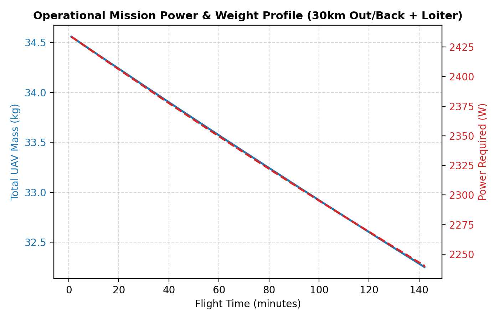
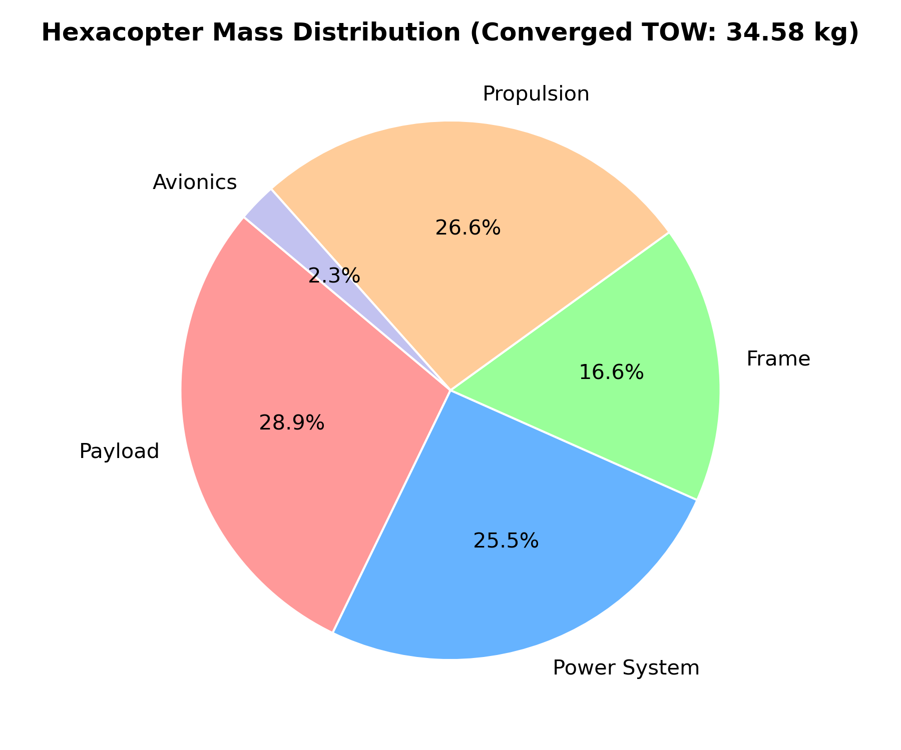
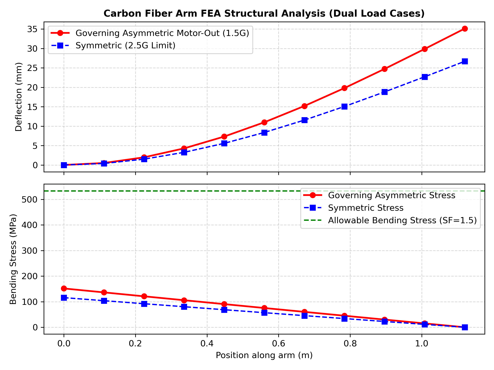

# Designing a 34kg Hybrid Hexacopter: Sizing, BEM Aerodynamics, and Structural Dynamics

I didn’t start this project to design a toy drone.
I started it because I wanted to solve a genuinely hard multirotor engineering problem:
How do you design a UAV to carry a **10 kg payload** over a **30 km radius** (60 km total out-and-back) with a 20-minute on-station loiter?

That is about two hours of total flight endurance under high loading.
Most hobby-class multirotors top out around 5 kg of useful payload and 30 minutes of flight.
To make this happen, I had to transition to a gas-electric hybrid powerplant and model the entire aircraft from first principles:
- Aerodynamic rotor optimization (Blade Element Momentum)
- Multi-phase takeoff mass convergence
- Cantilever arm structural deflection under failure states
- Structural vibration resonance avoidance
No hand-waving estimates. No guessing. Just coupled physics.

---

## WHY THIS PROJECT?
Most drone design tutorials assume you can just pick motors and batteries off a shelf.
That works for 2 kg builds. It fails completely at 34 kg.
At this scale:
- Structural arms bend under thrust loads.
- Power distribution wires turn into heaters due to Joule losses.
- Rotor rotation frequencies can destroy carbon fiber tubes via resonance.
- Adding battery mass actually reduces your flight range.
I wanted to design the entire aircraft by linking these physical subsystems together into a single self-consistent model.

---

## HEXACOPTOR TOPOLOGY & PROPELLER TRADES
The first decision was configuration.
I chose a standard single-motor hexacopter:
- 6 arms at 60-degree radial increments.
- Active motor-out control authority.
- Less dry mass than an octocopter.

The baseline recommendation was 36-inch propellers.
But I wanted to verify if pushing the prop diameter to the 40-inch limit would yield a better efficiency trade-off.
I ran a Blade Element Momentum (BEM) study comparing both.

The results made the decision obvious:
- The 40-inch propeller (40" x 13" carbon fiber) gave a 19.1% improvement in hover efficiency.
- Hover efficiency jumped to 8.1 g/W (compared to 6.8 g/W for 36").
- Total hover power was cut by 427W, from 2,477W to 2,050W at the same take-off weight.
- Nominal hover RPM dropped to 1,850, reducing profile drag and acoustics.

The tradeoff? Arm length.
To maintain a safe 104 mm tip-to-tip clearance margin between adjacent 40" propellers without any aerodynamic overlap, the arm length had to stretch to 1.12 m.
This gave the aircraft a motor-to-motor diagonal diameter of 2.24 m.

---

## SOLVING THE MASS-POWER-FUEL LOOP
In conceptual aircraft design, everything is circularly dependent.
A heavier drone needs more thrust.
More thrust demands more electrical power.
More power burns more fuel from the hybrid generator.
More fuel adds weight back onto the aircraft, requiring even more thrust.

A single-pass weight estimate misses this feedback loop entirely.
If I had stopped after one pass, I would have under-predicted the Take-Off Weight (TOW) by nearly 1.9 kg. That's enough to cause a mid-air power failure.

To solve this, I built a 5-iteration convergence loop using fixed-point iteration:

By the fifth iteration, the Take-Off Weight converged to exactly **34.575 kg**:
- **Payload:** 10.000 kg (28.9%)
- **Hybrid Powerplant:** 12.000 kg (34.7%)
- **Fuel (with 20% Reserve):** 2.323 kg (17.1% - 1.859 kg burned during the mission)
- **Dry Vehicle Mass:** 22.252 kg (20.9% - including 0.392 kg/arm carbon tubes)

---

## THE STRUCTURAL SURPRISE: FAILURE GOVERNS
The structural arms are hollow carbon fiber tubes (30 mm outer diameter, 2 mm wall thickness, 1.12 m length).
My first instinct was that the symmetric 2.5G limit load case would govern the arm sizing.
It carries the highest total vertical lift force: 848N total, or 141.3 N per arm.

But I was wrong.
When I modeled the asymmetric motor-out emergency recovery case (under 1.5G load), the load distribution changed.
If one motor fails, the remaining active arms must spool up to balance the rolling and pitching moments of the aircraft.
Because of this moment-compensation logic, the load concentrates onto fewer arms.

The active arms adjacent to the failed rotor must carry a peak force of **169.6 N**.
That is 20% higher than the per-arm load under the symmetric 2.5G case.

This failure case governed the design, producing:
- A root bending moment of **189.9 N-m**.
- A peak root bending stress of **164.4 MPa**.
- A tip deflection of **14.1 mm**.

This yielded a safety factor of **4.87**, comfortably passing the required aerospace safety margin of 1.5.
The lesson: emergency states, not nominal load factors, dictate structural limits.

---

## THE OVERLAPPING PROPELLER BUG
Every engineering project has a debugging story.
In an early run of the CAD generator, I noticed that the 3D model rendered with the 40-inch propellers overlapping in the center.

The bug was simple but honest:
The script was placing the newly selected 40-inch propellers on the arm lengths calculated during the 36-inch propeller phase.
Because I had hardcoded the arm length baseline in the CAD assembly script rather than linking it dynamically to the propeller sizing trade study, the adjacent propeller tips were physically colliding in the assembly. 

To fix this, I refactored the design configuration parameters so that the arm length was derived directly from the selected propeller radius plus the required 104 mm clearance margin. Checking the tip-to-tip clearance variables after the fix confirmed that the clearance was exactly 10.2% of the propeller diameter, preventing any blade collision.

---

## WHAT I LEARNED
This project changed how I think about system design:

### 1. Coupled loops are non-negotiable
Single-pass estimates are a recipe for failure in heavy-lift aircraft. If you don't iterate your weight and power calculations, your drone will run out of power mid-flight.

### 2. Failure cases dictate structure
A symmetric G-load case sounds like the worst-case scenario. But asymmetric motor-out compensation loads the structural frame far more severely.

### 3. Vibration is the silent killer
With 1.12 m arms, you must solve the exact transcendental eigenvalue equation for a cantilever beam with a tip-mass to find natural frequencies. My fundamental frequency was 8.65 Hz. Plotting this on a Campbell Diagram confirmed that the entire operational envelope (1,000 to 2,600 RPM) was free of resonance.

### 4. Thermal wiring sizing matters
At 30 A current peaks, thin 18 AWG wire would reach 225.6°C and melt its silicone insulation. Upgrading to 14 AWG keeps temperatures at a safe 77.8°C, leaving a 122.2°C thermal safety margin.

---

## WHAT'S NEXT
The design is structurally and thermodynamically verified, but there is still room to optimize:
- **Weight Optimization:** A safety factor of 4.87 is very conservative. I want to run a wall-thickness optimization pass on the arm tubes to shave off dry weight.
- **Rotor-Rotor Interaction:** Our BEM solver assumes isolated rotors. In reality, adjacent wake interactions will cause local turbulence and lift losses.
- **Aeroelastic Validation:** I want to validate the blade polars against full QBlade simulation data.

---

## FINAL THOUGHT
This project was about understanding how different domains—aerodynamics, structures, dynamics, and thermal behavior—couple together under extreme design limits.
Once you model those coupling boundaries clearly, designing a safe, high-performance aircraft becomes possible.

— Vaibhav Parashari

***

*Find the complete design files, simulation scripts, and CAD models in the [GitHub Repository](https://github.com/Bishu-crypto/quadcopter-autonomy/tree/main/projects/heavy-lift-uav) and read the full technical document in the [PDF Report](../reports/heavy_lift_uav_design_report.pdf).*
