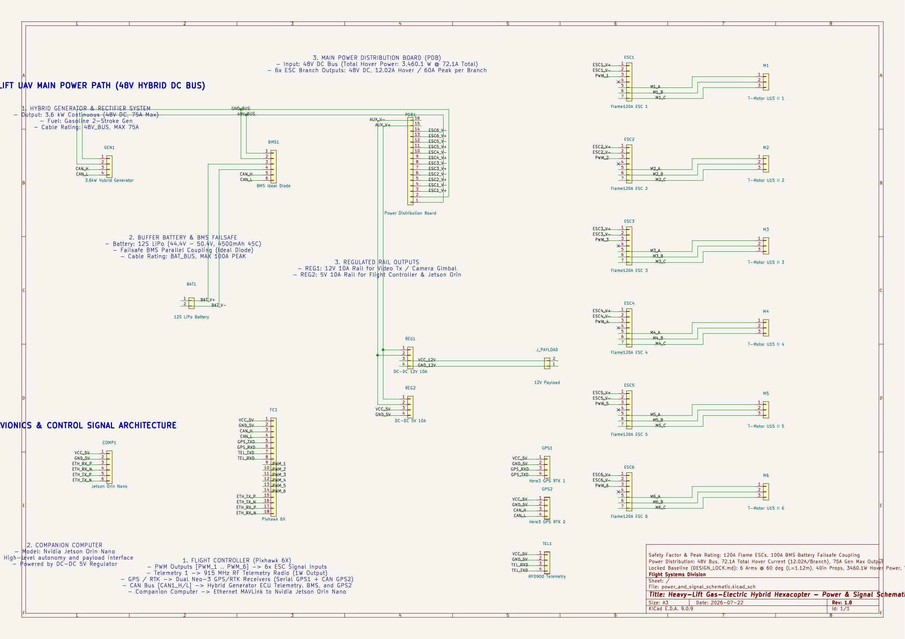

# KiCad Power & Signal Schematic Subsystem

This directory houses the KiCad 9.0.9 power and signal distribution schematic for the heavy-lift gas-electric hybrid hexacopter.



## 📌 Description

The schematic maps the 48V DC bus routing from the 3.6 kW generator and LiPo buffer battery to Eeschema symbol pins for the Pixhawk 6X flight controller, 6 ESC branches, and 12V/5V avionics buck regulators. It was generated programmatically using python S-expression formatting to ensure KiCad 9.0.9 compatibility without schematic parser errors.

## 🛠️ Reproducibility

To regenerate the KiCad v9.0.9 schematic file programmatically:

```bash
# From the project root, run the schematic builder:
python3 projects/heavy-lift-uav/kicad/generate_schematic_v9.py
```
