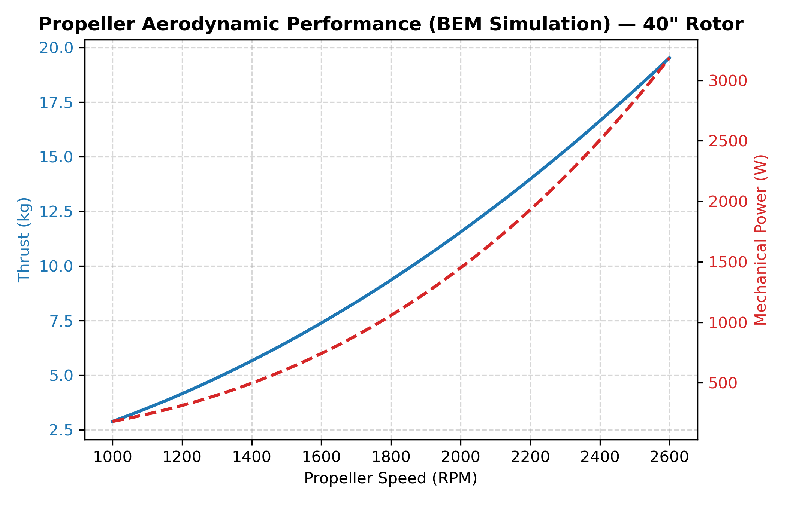

# XFLR5 / QBlade 40" x 13" Propeller Aerodynamics

This directory contains the aerodynamic geometry definitions and polar tables for the 40-inch carbon fiber propeller.



## 📌 Description

The database includes NACA 4412 airfoil coordinates, spanwise chord/twist station definitions, and ASCII formats for QBlade and AeroDyn import. These files are used to perform Blade Element Momentum (BEM) simulation sweeps under rotating hover conditions to validate thrust-to-power and hover efficiency profiles.

## 🛠️ Reproducibility

To import the geometry and run BEM analysis:

```bash
# 1. Load airfoil coords in QBlade or XFLR5 using:
#    xflr5/naca4412.dat
# 2. Import blade definition file for rotor BEM sweeps:
#    xflr5/propeller_40x13_qblade.bld
```
