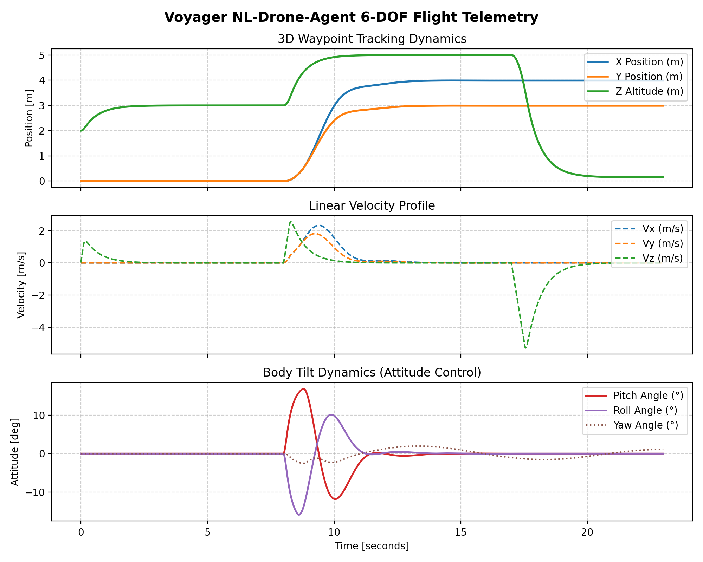

# Voyager — NL-Drone-Agent (MuJoCo)




Text-command-controlled flight of the actual heavy-lift hexacopter geometry
(from `projects/heavy-lift-uav/`), simulated in MuJoCo with real converged
mass/inertia values, full 6-DOF 3D position control, and a swappable LLM tool-calling agent.

---

## What's Real Here

- **Geometry & Mesh**: `hexacopter.xml` loads the real assembly mesh (`assets/hexacopter_body.stl`, scaled from `reports/uav_assembly_1_10.stl`) from the heavy-lift UAV design.
- **Mass Budget Alignment**: Pulled directly from `mass_budget.py`'s TOW convergence loop ($350$ Wh/kg baseline / $520$ Wh/kg tier):
  - TOW: $37.291$ kg
  - CG: $[0.0000, 0.0000, -0.0521]$ m
  - Inertia (diag): $I_{xx}=5.8965, I_{yy}=5.8815, I_{zz}=11.1390 \text{ kg}\cdot\text{m}^2$
  - 6 rotors, $1.12$ m arm length, alternating CW/CCW
  - Hover thrust: $60.97 \text{ N}$ per rotor ($365.82 \text{ N}$ total balancing $m \cdot g$)
- **Swappable LLM Tool-Calling Layer**: Integrates `LLMToolAgent` (`llm_client.py`), constraining natural language inputs strictly to a fixed schema (`takeoff`, `goto`, `land`, `hold`, `set_velocity`, `get_status`). Supports live API models (Gemini / OpenAI) as well as an intelligent context-aware offline engine for relative text commands ("go up 2m higher").
- **Deterministic Safety Layer**: `safety.py` enforces hard physical bounds ($Z_{max}=50\text{m}, Z_{min}=0.15\text{m}, V_{max}=8\text{m/s}, R_{geofence}=100\text{m}$) BEFORE tool calls reach the drone. Unsafe commands are explicitly rejected with explanatory messages.
- **Full 6-DOF 3D Position Control**: Upgraded `controller.py` implements cascaded position, velocity, and attitude (pitch/roll tilt) control via differential thrust allocation across all 6 hexacopter rotors.
- **Interactive Dialogue Node**: `dialogue_node.py` provides turn-by-turn context tracking and real MuJoCo sensor telemetry feedback.
- **Offscreen Rendering & Telemetry**: Off-line offscreen video rendering (`render_video.py` $\rightarrow$ `flight_demo.mp4`) and multi-axis telemetry plots (`flight_demo_plot.png`).

---

## What's NOT Done Yet (Next Steps)

- Vision/camera feed integration for visual target tracking
- ROS 2 node bridge for real-time PX4 / Gazebo SITL deployment
- Manipulator arm integration (this stage is airframe-only)

---

## File Structure

```
projects/nl-drone-agent/
├── assets/
│   └── hexacopter_body.stl      # Scaled CAD assembly mesh
├── hexacopter.xml               # MJCF model (built by generate_mjcf.py)
├── generate_mjcf.py             # Generates MJCF model from converged mass parameters
├── safety.py                    # Deterministic safety bounds checker
├── llm_client.py                # Swappable LLM tool-calling layer & mock engine
├── controller.py                # Cascaded 6-DOF position, attitude & differential thrust controller
├── dialogue_control.py          # Safety-validated execution pipeline demo
├── dialogue_node.py             # Interactive CLI & batch dialogue node
├── render_video.py              # Offscreen MuJoCo video renderer (flight_demo.mp4)
├── plot_telemetry.py            # Generates flight_demo_plot.png telemetry chart
├── DESIGN_LOCK.md               # Technical specification & formula reference
├── README.md                    # Sub-project documentation
├── flight_transcript.txt        # Command / response transcript output
├── flight_log.json              # Time-series telemetry log
├── flight_demo.mp4              # Rendered 3D flight demonstration video
└── flight_demo_plot.png         # Telemetry visualization plot
```

---

## How to Run

### 1. Build Model Geometry & MJCF
```bash
python3 generate_mjcf.py
```

### 2. Run Dialogue Control Demo (Safety + 6-DOF Flight)
```bash
python3 dialogue_control.py
```

### 3. Launch Interactive Dialogue CLI
```bash
python3 dialogue_node.py --interactive
```
Or execute batch natural-language queries:
```bash
python3 dialogue_node.py "takeoff to 4m" "goto 3, 3, 5" "status" "land"
```

### 4. Render 3D Offscreen Video & Telemetry Charts
```bash
python3 render_video.py
```
Outputs `flight_demo.mp4` and `flight_demo_plot.png`.
